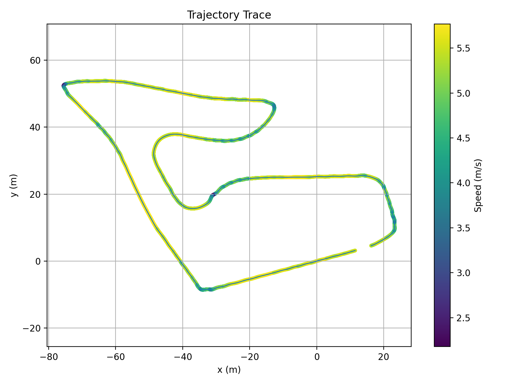
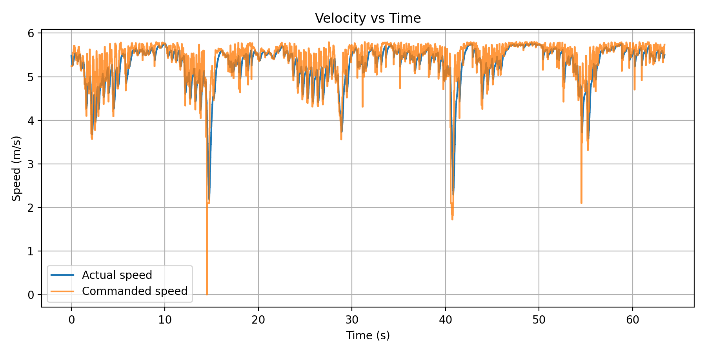
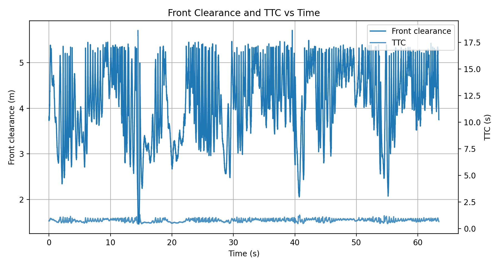
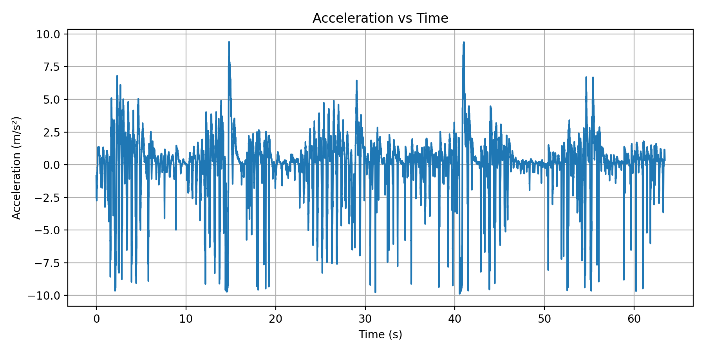

::: {.hero-section .hero-racing}

::: {.hero-badge}
ECE 484 Midpoint · F1TENTH Time Trial
:::

# Group Invincible: F1TENTH Time Trial{.title}

::: {.subtitle}
Designing a fast, reliable, and competition-ready autonomous race car on a stock F1TENTH platform — with a reactive gap controller and a map-based A* + Stanley pipeline, validated in simulation and deployed on hardware.
:::

::: {.author-list}
**Zhenyu Zhang**,
**Yuanzhe Wang**,
**Murphy Huang**
:::

::: {.affiliation-list}
^1^University of Illinois Urbana-Champaign · ECE 484 · Spring 2026
:::

::: {.button-row}
[[ Demo Video]{.btn-text}](https://youtu.be/AghdeVoMORM){.btn .btn-primary}
[[ GitHub]{.btn-text}](https://github.com/safeautonomy-illinois-students/project-site-invincible_proj/){.btn .btn-primary}
[[ Algorithms]{.btn-text}](#algorithms){.btn .btn-primary}
[[ Results]{.btn-text}](#results){.btn .btn-primary}
:::

::: {.hero-highlight-grid}
::: {.hero-highlight-card}
<div class="highlight-label">Goal</div>
<div class="highlight-value">Finish the track quickly and cleanly</div>
<div class="highlight-note">Optimize for speed, stability, and lap consistency in a one-car time trial setting.</div>
:::

::: {.hero-highlight-card}
<div class="highlight-label">Two Approaches</div>
<div class="highlight-value">Reactive · Map-Based</div>
<div class="highlight-note">Reactive gap-following for simplicity and hardware deployment; A* + Stanley for globally optimal path planning.</div>
:::

::: {.hero-highlight-card}
<div class="highlight-label">Deployment</div>
<div class="highlight-value">Simulation + Real Car</div>
<div class="highlight-note">Both approaches validated in the F1TENTH simulator; reactive controller deployed and tested on the physical vehicle.</div>
:::
:::

:::

::: {.section-container .section-soft}

::: {.hero-summary-panel}
<div class="summary-kicker">Midpoint Snapshot</div>
<div class="summary-text">
We designed and compared two complete autonomous driving strategies for the F1TENTH time trial. The first is a map-free reactive controller — it processes each LiDAR scan in real time to identify the safest open gap and steer toward it, requiring no prior mapping or localization. The second is a map-based pipeline combining A* path planning with cubic B-spline smoothing, physics-aware velocity profiling, and a Stanley lateral controller. Both were validated in the F1TENTH Gym simulator. The reactive approach was then successfully deployed on the physical car with hardware-specific safety adaptations.
</div>
<div class="chip-row">
<span class="info-chip">Real vehicle</span>
<span class="info-chip">Reactive + Map-based</span>
<span class="info-chip">Simulation validated</span>
<span class="info-chip">Safety + performance</span>
</div>
:::

:::

::: {#overview .section-container}

## Overview {.section-title}

::: {.abstract-text}
The F1TENTH time trial requires a fully autonomous stack capable of navigating a closed track as fast as possible without human intervention. We pursued two distinct design strategies. The first — a pure reactive controller — requires no prior map: it identifies the largest free-space gap in each LiDAR scan and steers toward it, relying entirely on real-time sensor data at 25 Hz. The second — a map-based pipeline — builds an occupancy grid, plans a globally optimal collision-free path with A*, smooths it into a continuous trajectory using cubic B-spline interpolation, generates a curvature-aware speed profile from track geometry, and tracks the path using a Stanley controller. Both approaches were fully implemented in ROS 2 and validated in the F1TENTH Gym simulator. For hardware deployment, we selected the reactive approach for its simplicity and zero-infrastructure requirement, adapting it with conservative safety margins, joystick-based enable control, and hardware-specific ROS topic names.
:::

:::

::: {.section-band}
::: {#algorithms .section-container}

## Algorithm Design {.section-title}

::: {.content-text}
We implemented two complete, independent autonomy stacks. Both share the same sensing front-end — a 2D LiDAR scan — but differ fundamentally in how they make driving decisions.
:::

::: {.challenge-grid}
::: {.challenge-card}
### Approach 1 · Reactive Gap Following

A map-free controller that runs entirely on real-time LiDAR data. Each scan is processed to find the largest open gap ahead; steering and speed are commanded directly with no planning, localization, or prior map. The algorithm combines disparity extension (obstacle inflation based on car width), a dynamic safety bubble around the closest point, weighted gap scoring, corridor balance, and opening bias into a single compact control loop running at 25 Hz.

**Sensor:** LiDAR only &nbsp;·&nbsp; **Map required:** No &nbsp;·&nbsp; **Deployed on:** Simulation + Physical Car
:::

::: {.challenge-card}
### Approach 2 · A\* + Stanley Controller

A two-node map-based pipeline. An A* planner searches the ROS OccupancyGrid for a collision-free path to a goal pose set in RViz, smooths it with cubic B-spline interpolation, and attaches a physics-aware velocity profile based on local track curvature. A Stanley controller then tracks this path by correcting both heading error and lateral cross-track error simultaneously, with lookahead-based predictive speed control.

**Sensor:** LiDAR + Map &nbsp;·&nbsp; **Map required:** Yes &nbsp;·&nbsp; **Deployed on:** Simulation only
:::
:::

---

### Approach 1 — Reactive Gap Following: Step by Step

::: {.pipeline-grid}
::: {.pipeline-step}
<div class="step-number">01</div>
<h3>LiDAR Preprocessing</h3>
<p>Clip all readings to 10 m and replace NaN/Inf values with max range. Apply a 5-beam moving-average kernel to reduce noise spikes. Restrict to a ±100° front field of view, discarding rays that point behind the car.</p>
:::

::: {.pipeline-step}
<div class="step-number">02</div>
<h3>Obstacle Safety Margins</h3>
<p><strong>Disparity Extension:</strong> At every depth jump &gt; 0.35 m between adjacent beams, inflate the nearer side by n = ⌈arctan((w + m) / r) / Δθ⌉ beams (w = 0.16 m car half-width, m = 0.18 m safety margin). This prevents the car from targeting gaps it physically cannot fit through.</p>
<p><strong>Safety Bubble:</strong> Zero out all beams within a radius of the single closest point. Radius grows with current speed and steering angle, providing greater buffer at higher velocities.</p>
:::

::: {.pipeline-step}
<div class="step-number">03</div>
<h3>Gap Selection</h3>
<p>Find all contiguous beam segments with depth &gt; 1.25 m. Score each segment by: 0.04 × width + 1.0 × mean depth + 0.6 × max depth − 0.8 × |center angle|. Within the best segment, pick a target point biased toward far, forward-facing beams using per-beam scoring. Blend 72% toward best point and 28% toward gap center for the final target angle.</p>
:::

::: {.pipeline-step}
<div class="step-number">04</div>
<h3>Steering &amp; Speed</h3>
<p><strong>Steering:</strong> δ = k<sub>g</sub>·θ<sub>target</sub> + k<sub>b</sub>·balance + b<sub>open</sub>, where <em>balance</em> nudges toward the more open side of the corridor and <em>opening bias</em> anticipates upcoming turns. Output is rate-limited to 0.12 rad/cycle and low-pass filtered (α = 0.55) for smooth commands.</p>
<p><strong>Speed:</strong> v = v<sub>min</sub> + (v<sub>max</sub> − v<sub>min</sub>)(0.45·f<sub>straight</sub> + 0.55·f<sub>open</sub>) − 1.8|δ| − 0.7|θ<sub>target</sub>|. Hard stop if front clearance &lt; 0.6 m or TTC &lt; 0.42 s.</p>
:::
:::

---

### Approach 2 — A\* + Stanley Controller: Step by Step

::: {.pipeline-grid}
::: {.pipeline-step}
<div class="step-number">01</div>
<h3>A\* Path Search</h3>
<p>Operates on the ROS OccupancyGrid published by SLAM. Uses 8-directional movement with an 8-cell safety padding around all occupied cells. Cost function: g-score is Euclidean distance traveled; heuristic is Euclidean distance to goal. Planning is triggered by a goal pose clicked in RViz.</p>
:::

::: {.pipeline-step}
<div class="step-number">02</div>
<h3>Path Smoothing</h3>
<p>The raw A* waypoint sequence has grid-aligned staircase artifacts. A cubic B-spline (scipy <code>splprep</code>, k = 3, s = 0.5) is fitted to the waypoints and re-sampled at 3× the original density. This produces a smooth, continuous reference curve suitable for a path-tracking controller.</p>
:::

::: {.pipeline-step}
<div class="step-number">03</div>
<h3>Velocity Profiling</h3>
<p>Menger curvature κ = 4A / (a·b·c) is computed from each consecutive triple of waypoints, where A is the triangle area and a, b, c are side lengths. Physics-based speed limit: v = √(μ·g·R), with μ = 0.8 (tire friction) and g = 9.81 m/s². Speed is clamped to 1.5–6.0 m/s. Each waypoint's target speed is embedded in the Z coordinate of the ROS path message.</p>
:::

::: {.pipeline-step}
<div class="step-number">04</div>
<h3>Stanley Tracking</h3>
<p>Steering: δ = θ<sub>e</sub> + arctan(k·e<sub>ct</sub> / (v + k<sub>s</sub>)), where θ<sub>e</sub> is heading error and e<sub>ct</sub> is signed cross-track error measured at the front axle. k = 2.5 scales dynamically with speed: k<sub>dyn</sub> = k × (1 + 0.2v). Speed control previews 15 waypoints ahead — curvature &gt; 0.35: 1.5 m/s; &gt; 0.15: 2.0 m/s; else: 3.2 m/s.</p>
:::
:::

:::
:::


::: {.section-band}
::: {#sim-to-real .section-container}

## Simulation → Real Car {.section-title}

::: {.content-text}
For hardware deployment we chose the reactive gap controller — it requires no map, no localization infrastructure, and no goal pose. The same core algorithm runs on the physical car with five targeted adaptations:

**1. ROS Interface** — Topic names changed from simulator paths (`/ego_racecar/scan`, `/ego_racecar/drive`) to hardware paths (`/scan`, `/ackermann_cmd`).

**2. Joystick Safety Enable** — The controller activates only while the operator holds the Y button on the joystick. On release, steering resets to zero to prevent a jerky restart.

**3. Odometry-Free TTC** — The physical car had unreliable odometry, so time-to-collision is estimated using a fixed conservative floor speed (0.10 m/s) instead of `/odom` feedback. This decouples the safety check from odometry quality entirely.

**4. Conservative Speed Limits** — Maximum speed reduced from 3.8 m/s (simulation) to 1.5 m/s. Emergency brake distance and TTC threshold were both tightened for hardware safety.

**5. Scan-Driven Loop** — Replaced the 25 Hz timer-based control loop with a per-scan callback so every incoming LiDAR message directly triggers a control output, eliminating one source of latency.
:::

::: {.comparison-table-wrap}

| Parameter | Simulation | Real Car |
|---|---|---|
| LiDAR topic | `/ego_racecar/scan` | `/scan` |
| Drive topic | `/ego_racecar/drive` | `/ackermann_cmd` |
| Odometry | `/ego_racecar/odom` (for TTC) | Not used — fixed floor speed |
| Enable control | Always active | Y button held on joystick |
| Control trigger | 25 Hz timer | Per-scan callback |
| Max speed | 3.8 m/s | 1.5 m/s |
| Min speed | 1.1 m/s | 0.8 m/s |
| Emergency brake distance | 0.60 m | 0.70 m |
| TTC threshold | 0.42 s | 0.50 s |

:::

:::
:::

::: {.section-band .section-band-dark}
::: {#demo .section-container}

## Demo Videos {.section-title .section-title-light}

::: {.content-text .content-text-light}
Simulation and real-car recordings of the Reactive Gap Following controller.
:::

<div style="margin-top:1.5rem;">
<p style="font-size:0.82rem;font-weight:800;text-transform:uppercase;letter-spacing:0.08em;color:#00b7ff;margin-bottom:0.8rem;">Simulation</p>
</div>

::: {.challenge-grid}
::: {.challenge-card}
**Short Run**

::: {.video-container}

:::

Reactive gap controller navigating a short track segment in the F1TENTH simulator, showing the gap selection and obstacle avoidance behavior at close range.
:::

::: {.challenge-card}
**Long Run**

::: {.video-container}

:::

Full-length simulation run demonstrating consistent gap-following throughout a complete track lap, including straight-line speed and corner braking.
:::
:::

<div style="margin-top:1.5rem;">
<p style="font-size:0.82rem;font-weight:800;text-transform:uppercase;letter-spacing:0.08em;color:#00b7ff;margin-bottom:0.8rem;">Real Car</p>
</div>

::: {.challenge-grid}
::: {.challenge-card}
**Hardware Demo**

::: {.video-container}

:::

Initial hardware test showing the physical F1TENTH car operating under joystick-enabled autonomous control with the reactive controller active.
:::

::: {.challenge-card}
**Reactive Gap Following on Hardware**

::: {.video-container}

:::

Full reactive gap-following run on the physical car, demonstrating the sim-to-real transfer with conservative speed limits and scan-driven control.
:::
:::

:::
:::

::: {#results .section-container}

## Results & Evaluation {.section-title}

::: {.content-text}
Both approaches completed a full lap in simulation with no wall contact and 100% track coverage. The key trade-off is lap time versus planning overhead: A* + Stanley posts a faster raw lap but requires over a minute of pre-run planning; the reactive controller is slower on track but starts instantly with no map or goal setup.
:::

::: {.comparison-table-wrap}

| Metric | Reactive Gap Following | A\* + Stanley |
|---|---|---|
| Lap time | 64 s | 58 s |
| Planning / thinking time | 0 s (reactive, no map) | 62 s (A\* search + smoothing) |
| Wall contact | None | None |
| Track completion | 100% | 100% |

:::

---

### A\* + Stanley Controller — Run Analysis

::: {.content-text}
The plot below is extracted from a rosbag recording of the A* + Stanley pipeline executing a single planned path segment in simulation.
:::

::: {.flowchart-wrap}
{width="88%"}
:::

::: {.content-text}
**Left — Trajectory (color = speed):** The A* planner computed a smooth curved path from the start pose (red circle, origin) to the goal pose (blue triangle, ~3.5 m ahead). The Stanley controller tracked it with no visible deviation — the trajectory trace is a clean single line throughout. Speed is color-coded: the car starts from rest (dark purple), accelerates through the curve, and reaches a cruise speed of ~1.0–1.1 m/s (yellow-green) by the midpoint of the path.

**Right — Speed Profile:** Speed is plotted against rosbag message index. The car ramps up sharply to ~1.0 m/s within the first ~50 messages, holds a steady cruise for approximately 200 messages while tracking the path, then drops to zero when the Stanley controller detects arrival at the final waypoint. The remaining ~1500 messages record the car at rest after goal completion. The clean ramp-and-hold profile confirms that the lookahead-based speed control produces smooth, predictable longitudinal behavior with no overshoot.
:::

---

### Reactive Gap Following — Run Analysis

::: {.content-text}
The following plots are recorded from a single simulation lap (run `20260419_131930`).
:::

::: {.challenge-grid}
::: {.challenge-card}


**Trajectory Trace** — The car's path is color-coded by speed. Yellow and green segments (5–5.5+ m/s) dominate the straights, while blue and purple sections (2.5–3.5 m/s) appear at all major corners. The tight, consistent trace shows the reactive controller produces a repeatable path that naturally hugs the racing line without any explicit path planning.
:::

::: {.challenge-card}


**Velocity vs Time** — Commanded and actual speed track each other almost perfectly throughout the 64-second run. The car holds ~5.5 m/s on straights and dips to 2–3 m/s at five to six corners, matching the speed-scheduling formula that reduces speed with steering angle and target gap angle. The tight commanded-vs-actual overlap confirms the low-level drive interface follows commands faithfully.
:::

::: {.challenge-card}


**Front Clearance and TTC vs Time** — Front clearance (left axis) oscillates between 2 and 5 m throughout the run, reflecting the gap controller actively seeking open space. The TTC (right axis) remains consistently low but never drops below the emergency threshold — the controller never triggered a hard stop. This confirms that the disparity extension and dynamic bubble margins provided sufficient obstacle safety throughout.
:::

::: {.challenge-card}


**Acceleration vs Time** — The reactive controller produces high-frequency acceleration changes, with peak magnitudes within ±10 m/s². This is characteristic of a scan-driven reactive approach: speed is recomputed every LiDAR scan and responds immediately to changing gap geometry. The bursts of high deceleration correspond to the corner entry events visible in the velocity plot.
:::
:::

:::

::: {#future .section-container}

## Future Improvements {.section-title}

::: {.content-text}
With both simulation pipelines validated and the reactive controller running on hardware, the team's next steps focus on closing the performance gap between simulation and competition:

- **Deploy A\* + Stanley on hardware** — the map-based pipeline is currently simulation-only; deploying it requires integrating Google Cartographer SLAM for real-time occupancy grid mapping and vehicle localization on the physical car.
- **Increase real-car speed** — the current 1.5 m/s hardware cap is well below the 3.8 m/s achieved in simulation; incremental speed increases paired with re-tuned safety thresholds are planned.
- **Dynamic bubble scaling** — at higher speeds, the fixed bubble radius is insufficient; a look-ahead distance scaling with v² is under consideration for better high-speed safety.
- **Curvature-aware speed on reactive controller** — apply the same Menger curvature velocity profiling from the A* pipeline to the reactive controller so cornering speed is physically consistent even without a global path.
- **Lap time optimization** — fine-tune steering blend coefficients and gap scoring weights specifically for the competition track geometry once the track layout is finalized.
:::

:::


::: {.section-container}

## Related Works {.section-title}

::: {.resource-grid}
::: {.resource-card}
**Follow the Gap Method**
Sezer, V., & Gokasan, M. (2012). A novel obstacle avoidance algorithm: "Follow the Gap Method". *Robotics and Autonomous Systems*, 60(9), 1123–1134.
[Paper](https://www.sciencedirect.com/science/article/pii/S0921889012000838)
:::

::: {.resource-card}
**F1TENTH Platform**
O'Kelly, M., Zheng, H., Karthik, D., & Mangharam, R. (2020). F1TENTH: An Open-source Evaluation Environment for Continuous Control and Reinforcement Learning. *Proceedings of Machine Learning Research*, 123, 77–89.
[Paper](https://proceedings.mlr.press/v123/o-kelly20a.html)
:::

::: {.resource-card}
**F1TENTH Racing Survey**
Betz, J. et al. (2024). Unifying F1TENTH Autonomous Racing: Survey, Methods and Benchmarks.
[Paper](https://arxiv.org/abs/2402.18558)
:::
:::

:::

::: {.section-container}

## Project Resources {.section-title}

::: {.resource-grid}
::: {.resource-card}
**Codebase**
Implementation and website repository:
[project-site-invincible_proj](https://github.com/safeautonomy-illinois-students/project-site-invincible_proj/)
:::

::: {.resource-card}
**Demo Media**
Current simulation demo:
[YouTube Demo](https://youtu.be/AghdeVoMORM)
:::

::: {.resource-card}
**What to Add Next**
Race images, lap-time tables, steering smoothness plots, ROS graph snapshots, and real-car test footage.
:::
:::

:::

::: {.section-container}

## BibTeX {.section-title}

```bibtex
@article{invincibleproj,
  title        = {invincible_proj: Autonomous F1TENTH Time Trial Racing},
  author       = {Zhenyu Zhang and Yuanzhe Wang and Murphy Huang},
  year         = {2026},
}
```

:::

::: {.site-footer}
This website is built with Quarto for an F1TENTH autonomous racing project page.
:::
