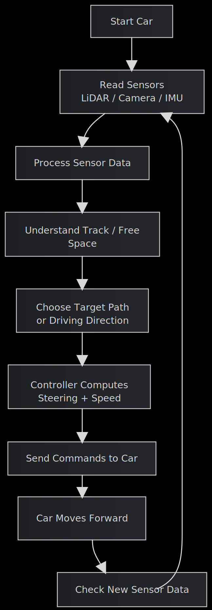

::: {.hero-section .hero-racing}

::: {.hero-badge}
ECE 484 Final Project · F1TENTH Time Trial
:::

# invincible_proj: Autonomous F1TENTH Time Trial Racing {.title}

::: {.subtitle}
Designing a fast, reliable, and competition-ready autonomous race car on a stock F1TENTH platform using onboard sensing, perception, planning, and control.
:::

::: {.author-list}
**Zhenyu Zhang**,
**Yuanzhe Wang**,
**Murphy Huang**
:::

::: {.affiliation-list}
^1^University of Illinois Urbana-Champaign · ECE 484 Autonomous Vehicles
:::

::: {.button-row}
[[ Demo Video]{.btn-text}](https://youtu.be/AghdeVoMORM){.btn .btn-primary}
[[ GitHub]{.btn-text}](https://github.com/safeautonomy-illinois-students/project-site-invincible_proj/){.btn .btn-primary}
[[ System]{.btn-text}](#system){.btn .btn-primary}
[[ Results]{.btn-text}](#results){.btn .btn-primary}
:::

::: {.hero-highlight-grid}
::: {.hero-highlight-card}
<div class="highlight-label">Goal</div>
<div class="highlight-value">Finish the track quickly and cleanly</div>
<div class="highlight-note">Optimize for speed, stability, and lap consistency in a one-car time trial setting.</div>
:::

::: {.hero-highlight-card}
<div class="highlight-label">Sensor Stack</div>
<div class="highlight-value">LiDAR · Camera · IMU</div>
<div class="highlight-note">Use any combination of stock onboard sensors without changing hardware.</div>
:::

::: {.hero-highlight-card}
<div class="highlight-label">Core Challenge</div>
<div class="highlight-value">Perception to control under tight latency</div>
<div class="highlight-note">Every module must work robustly enough for real-time autonomous driving on a race track.</div>
:::
:::

:::

::: {.section-container .section-soft}

::: {.hero-summary-panel}
<div class="summary-kicker">Project Snapshot</div>
<div class="summary-text">

</div>
<div class="chip-row">
<span class="info-chip">Real vehicle</span>
<span class="info-chip">Software-only improvements</span>
<span class="info-chip">Race against the clock</span>
<span class="info-chip">Safety + performance</span>
</div>
:::

:::

::: {#overview .section-container}

## Overview {.section-title}

::: {.abstract-text}
We approach the problem as a full autonomy stack. The vehicle uses onboard sensing to understand the nearby environment, converts that information into a track-relative driving objective, and then executes that objective through steering and speed control. Depending on the final system design, this can include LiDAR-based free-space reasoning, camera-based track understanding, IMU-assisted stabilization, or a hybrid fusion strategy. The final website is structured to show not only the racing result, but also the engineering decisions behind the result: sensing, planning, control logic, evaluation strategy, and lessons learned from real-car testing.
:::

:::

::: {.section-band}
::: {#challenge .section-container}

## Designed algorism plan  {.section-title}

::: {.challenge-grid}
::: {.challenge-card}
### obstacle situation (together as additional interesting point)
Reinforcement Learning (RL) for Proximal Policy Optimization (PPO) or Soft Actor-Critic (SAC). We use the 1080-array of LiDAR beams and current velocity to see steering angle and speed. Reward Function for +1 for maintaining high speed, -500 for triggering the TTC collision threshold. Artificial Potential Fields (APF) treats the car like a magnet. Your target destination pulls the car forward as attractive force, but any obstacles detected by the LiDAR push the car away as repulsive force.
:::

::: {.challenge-card}
### Controller (Zhenyu)
For lateral control, we implement the Pure Pursuit algorithm. Simultaneously, longitudinal control is handled by a PID controller, which regulates the car's throttle. Or Stanley Controller calculates both the cross-track error (how far off the line you are) and the heading error (the angle difference between the car and the track). This prevents the "snaking" or oscillating behavior that Pure Pursuit sometimes suffers from on straightaways.
:::

::: {.challenge-card}
### Real-Time Localization (Yuanzhe)
Our system utilizes Google Cartographer to solve the Simultaneous Localization and Mapping (SLAM) problem. By performing scan-matching between real-time 2D LiDAR data and IMU inputs, it constructs a high-resolution occupancy grid map of the track. Simultaneously, it provides the vehicle's precise $(x, y, \theta)$ pose estimate by comparing current sensor inputs against the established global map.
:::

::: {.challenge-card}
### optimal path (Murphy)
For navigation, we implement the A* Algorithm to compute the optimal path through the environment. Operating on the occupancy grid generated by the perception layer, A* employs a heuristic-based search to find the shortest collision-free route from the car's current position to the target waypoint. This ensures a globally consistent path that accounts for track boundaries and static obstacles.
:::
:::

:::
:::

::: {#system .section-container}

## System Pipeline {.section-title}

::: {.content-text}

:::

::: {.pipeline-grid}
::: {.pipeline-step}
<div class="step-number">01</div>
<h3>Sensing</h3>
<p> </p>
:::

::: {.pipeline-step}
<div class="step-number">02</div>
<h3>Track Understanding</h3>
<p> </p>
:::

::: {.pipeline-step}
<div class="step-number">03</div>
<h3>Planning</h3>
<p> </p>
:::

::: {.pipeline-step}
<div class="step-number">04</div>
<h3>Control</h3>
<p> </p>
:::
:::

::: {.flowchart-wrap}
{width="72%"}
:::


::: {.content-text}

:::

:::

::: {.section-band .section-band-dark}
::: {#demo .section-container}

## Demo Video {.section-title .section-title-light}

::: {.video-container .video-frame}

:::

::: {.content-text .content-text-light}
Base setup for the simulator
:::

:::
:::

::: {#results .section-container}

## Results & Evaluation {.section-title}

::: {.metrics-grid}
::: {.metric-card}
<div class="metric-label">Best Lap Time</div>
<div class="metric-value">TBD</div>
<div class="metric-note"> </div>
:::

::: {.metric-card}
<div class="metric-label">Completion Rate</div>
<div class="metric-value">TBD</div>
<div class="metric-note"> </div>
:::

::: {.metric-card}
<div class="metric-label">Controller Smoothness</div>
<div class="metric-value">TBD</div>
<div class="metric-note"> </div>
:::

::: {.metric-card}
<div class="metric-label">Top Reliable Speed</div>
<div class="metric-value">TBD</div>
<div class="metric-note"> </div>
:::
:::

::: {.content-text}

:::

:::


::: {#future .section-container}

## Future Improvements {.section-title}

::: {.content-text}
Later working on the algorithm.
:::

:::

::: {.section-container}

## Project Resources {.section-title}

::: {.resource-grid}
::: {.resource-card}
**Codebase**  
Implementation and website repository:  
[project-site-invincible_proj](https://github.com/safeautonomy-illinois-students/project-site-invincible_proj/)
:::

::: {.resource-card}
**Demo Media**  
Current embedded video:  
[YouTube Demo](https://youtu.be/AghdeVoMORM)
:::

::: {.resource-card}
**What to Add Next**  
Race images, trajectory plots, lap-time tables, ROS graph snapshots, and annotated failure cases.
:::
:::

:::

::: {.section-container}

## BibTeX {.section-title}

```bibtex
@misc{invincibleproj,
  title        = {invincible\_proj: Autonomous F1TENTH Time Trial Racing},
  author       = {Zhenyu Zhang and Yuanzhe Wang and Murphy Huang},
  year         = {2026},
  note         = {ECE 484 final project website},
  howpublished = {GitHub Pages project site}
}
```

:::

::: {.site-footer}
This website is built with Quarto for an F1TENTH autonomous racing project page.
:::