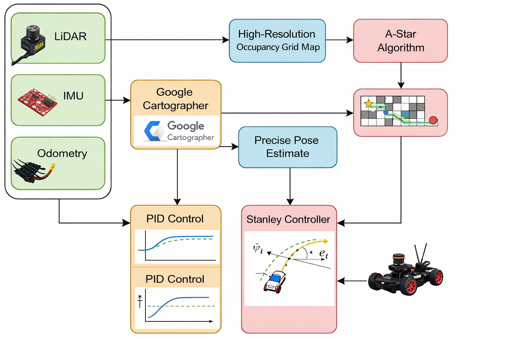
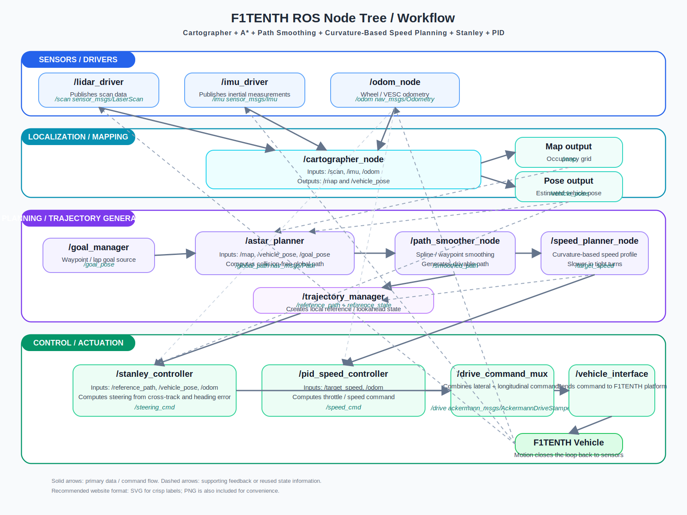

::: {.hero-section .hero-racing}

::: {.hero-badge}
ECE 484 Midpoint · F1TENTH Time Trial
:::

# Group Invincible: F1TENTH Time Trial{.title}

::: {.subtitle}
Designing a fast, reliable, and competition-ready autonomous race car on a stock F1TENTH platform — with a reactive gap controller and a map-based A* + Stanley pipeline, validated in simulation and deployed on hardware.
:::

::: {.author-list}
**Zhenyu Zhang**,
**Yuanzhe Wang**,
**Murphy Huang**
:::

::: {.affiliation-list}
^1^University of Illinois Urbana-Champaign · ECE 484 · Spring 2026
:::

::: {.button-row}
[[ Demo Video]{.btn-text}](https://youtu.be/AghdeVoMORM){.btn .btn-primary}
[[ GitHub]{.btn-text}](https://github.com/safeautonomy-illinois-students/project-site-invincible_proj/){.btn .btn-primary}
[[ Algorithms]{.btn-text}](#algorithms){.btn .btn-primary}
[[ Results]{.btn-text}](#results){.btn .btn-primary}
:::

::: {.hero-highlight-grid}
::: {.hero-highlight-card}
<div class="highlight-label">Goal</div>
<div class="highlight-value">Finish the track quickly and cleanly</div>
<div class="highlight-note">Optimize for speed, stability, and lap consistency in a one-car time trial setting.</div>
:::

::: {.hero-highlight-card}
<div class="highlight-label">Two Approaches</div>
<div class="highlight-value">Reactive · Map-Based</div>
<div class="highlight-note">Reactive gap-following for simplicity and hardware deployment; A* + Stanley for globally optimal path planning.</div>
:::

::: {.hero-highlight-card}
<div class="highlight-label">Deployment</div>
<div class="highlight-value">Simulation + Real Car</div>
<div class="highlight-note">Both approaches validated in the F1TENTH simulator; reactive controller deployed and tested on the physical vehicle.</div>
:::
:::

:::

::: {.section-container .section-soft}

::: {.hero-summary-panel}
<div class="summary-kicker">Midpoint Snapshot</div>
<div class="summary-text">
We designed and compared two complete autonomous driving strategies for the F1TENTH time trial. The first is a map-free reactive controller — it processes each LiDAR scan in real time to identify the safest open gap and steer toward it, requiring no prior mapping or localization. The second is a map-based pipeline combining A* path planning with cubic B-spline smoothing, physics-aware velocity profiling, and a Stanley lateral controller. Both were validated in the F1TENTH Gym simulator. The reactive approach was then successfully deployed on the physical car with hardware-specific safety adaptations.
</div>
<div class="chip-row">
<span class="info-chip">Real vehicle</span>
<span class="info-chip">Reactive + Map-based</span>
<span class="info-chip">Simulation validated</span>
<span class="info-chip">Safety + performance</span>
</div>
:::

:::

::: {#overview .section-container}

## Overview {.section-title}

::: {.abstract-text}
The F1TENTH time trial requires a fully autonomous stack capable of navigating a closed track as fast as possible without human intervention. We pursued two distinct design strategies. The first — a pure reactive controller — requires no prior map: it identifies the largest free-space gap in each LiDAR scan and steers toward it, relying entirely on real-time sensor data at 25 Hz. The second — a map-based pipeline — builds an occupancy grid, plans a globally optimal collision-free path with A*, smooths it into a continuous trajectory using cubic B-spline interpolation, generates a curvature-aware speed profile from track geometry, and tracks the path using a Stanley controller. Both approaches were fully implemented in ROS 2 and validated in the F1TENTH Gym simulator. For hardware deployment, we selected the reactive approach for its simplicity and zero-infrastructure requirement, adapting it with conservative safety margins, joystick-based enable control, and hardware-specific ROS topic names.
:::

:::

::: {.section-band}
::: {#algorithms .section-container}

## Algorithm Design {.section-title}

::: {.content-text}
We implemented two complete, independent autonomy stacks. Both share the same sensing front-end — a 2D LiDAR scan — but differ fundamentally in how they make driving decisions.
:::

::: {.challenge-grid}
::: {.challenge-card}
### Approach 1 · Reactive Gap Following

A map-free controller that runs entirely on real-time LiDAR data. Each scan is processed to find the largest open gap ahead; steering and speed are commanded directly with no planning, localization, or prior map. The algorithm combines disparity extension (obstacle inflation based on car width), a dynamic safety bubble around the closest point, weighted gap scoring, corridor balance, and opening bias into a single compact control loop running at 25 Hz.

**Sensor:** LiDAR only &nbsp;·&nbsp; **Map required:** No &nbsp;·&nbsp; **Deployed on:** Simulation + Physical Car
:::

::: {.challenge-card}
### Approach 2 · A\* + Stanley Controller

A two-node map-based pipeline. An A* planner searches the ROS OccupancyGrid for a collision-free path to a goal pose set in RViz, smooths it with cubic B-spline interpolation, and attaches a physics-aware velocity profile based on local track curvature. A Stanley controller then tracks this path by correcting both heading error and lateral cross-track error simultaneously, with lookahead-based predictive speed control.

**Sensor:** LiDAR + Map &nbsp;·&nbsp; **Map required:** Yes &nbsp;·&nbsp; **Deployed on:** Simulation only
:::
:::

---

### Approach 1 — Reactive Gap Following: Step by Step

::: {.pipeline-grid}
::: {.pipeline-step}
<div class="step-number">01</div>
<h3>LiDAR Preprocessing</h3>
<p>Clip all readings to 10 m and replace NaN/Inf values with max range. Apply a 5-beam moving-average kernel to reduce noise spikes. Restrict to a ±100° front field of view, discarding rays that point behind the car.</p>
:::

::: {.pipeline-step}
<div class="step-number">02</div>
<h3>Obstacle Safety Margins</h3>
<p><strong>Disparity Extension:</strong> At every depth jump &gt; 0.35 m between adjacent beams, inflate the nearer side by n = ⌈arctan((w + m) / r) / Δθ⌉ beams (w = 0.16 m car half-width, m = 0.18 m safety margin). This prevents the car from targeting gaps it physically cannot fit through.</p>
<p><strong>Safety Bubble:</strong> Zero out all beams within a radius of the single closest point. Radius grows with current speed and steering angle, providing greater buffer at higher velocities.</p>
:::

::: {.pipeline-step}
<div class="step-number">03</div>
<h3>Gap Selection</h3>
<p>Find all contiguous beam segments with depth &gt; 1.25 m. Score each segment by: 0.04 × width + 1.0 × mean depth + 0.6 × max depth − 0.8 × |center angle|. Within the best segment, pick a target point biased toward far, forward-facing beams using per-beam scoring. Blend 72% toward best point and 28% toward gap center for the final target angle.</p>
:::

::: {.pipeline-step}
<div class="step-number">04</div>
<h3>Steering &amp; Speed</h3>
<p><strong>Steering:</strong> δ = k<sub>g</sub>·θ<sub>target</sub> + k<sub>b</sub>·balance + b<sub>open</sub>, where <em>balance</em> nudges toward the more open side of the corridor and <em>opening bias</em> anticipates upcoming turns. Output is rate-limited to 0.12 rad/cycle and low-pass filtered (α = 0.55) for smooth commands.</p>
<p><strong>Speed:</strong> v = v<sub>min</sub> + (v<sub>max</sub> − v<sub>min</sub>)(0.45·f<sub>straight</sub> + 0.55·f<sub>open</sub>) − 1.8|δ| − 0.7|θ<sub>target</sub>|. Hard stop if front clearance &lt; 0.6 m or TTC &lt; 0.42 s.</p>
:::
:::

---

### Approach 2 — A\* + Stanley Controller: Step by Step

::: {.pipeline-grid}
::: {.pipeline-step}
<div class="step-number">01</div>
<h3>A\* Path Search</h3>
<p>Operates on the ROS OccupancyGrid published by SLAM. Uses 8-directional movement with an 8-cell safety padding around all occupied cells. Cost function: g-score is Euclidean distance traveled; heuristic is Euclidean distance to goal. Planning is triggered by a goal pose clicked in RViz.</p>
:::

::: {.pipeline-step}
<div class="step-number">02</div>
<h3>Path Smoothing</h3>
<p>The raw A* waypoint sequence has grid-aligned staircase artifacts. A cubic B-spline (scipy <code>splprep</code>, k = 3, s = 0.5) is fitted to the waypoints and re-sampled at 3× the original density. This produces a smooth, continuous reference curve suitable for a path-tracking controller.</p>
:::

::: {.pipeline-step}
<div class="step-number">03</div>
<h3>Velocity Profiling</h3>
<p>Menger curvature κ = 4A / (a·b·c) is computed from each consecutive triple of waypoints, where A is the triangle area and a, b, c are side lengths. Physics-based speed limit: v = √(μ·g·R), with μ = 0.8 (tire friction) and g = 9.81 m/s². Speed is clamped to 1.5–6.0 m/s. Each waypoint's target speed is embedded in the Z coordinate of the ROS path message.</p>
:::

::: {.pipeline-step}
<div class="step-number">04</div>
<h3>Stanley Tracking</h3>
<p>Steering: δ = θ<sub>e</sub> + arctan(k·e<sub>ct</sub> / (v + k<sub>s</sub>)), where θ<sub>e</sub> is heading error and e<sub>ct</sub> is signed cross-track error measured at the front axle. k = 2.5 scales dynamically with speed: k<sub>dyn</sub> = k × (1 + 0.2v). Speed control previews 15 waypoints ahead — curvature &gt; 0.35: 1.5 m/s; &gt; 0.15: 2.0 m/s; else: 3.2 m/s.</p>
:::
:::

:::
:::

::: {#system .section-container}

## System Pipeline {.section-title}

::: {.pipeline-grid}
::: {.pipeline-step}
<div class="step-number">01</div>
<h3>Sensing</h3>
<p>2D LiDAR provides a 270° range scan at 25 Hz as the primary perception input. IMU supplies orientation and angular rate for motion state estimation.</p>
:::

::: {.pipeline-step}
<div class="step-number">02</div>
<h3>Preprocessing</h3>
<p>Clip invalid readings to max range, smooth with a 5-beam moving-average kernel, and crop to the front FOV. Apply disparity extension to inflate obstacle edges and a dynamic safety bubble around the closest detected point.</p>
:::

::: {.pipeline-step}
<div class="step-number">03</div>
<h3>Planning</h3>
<p><strong>Reactive:</strong> Gap scoring across preprocessed beams → target angle.<br>
<strong>Map-based:</strong> A* on OccupancyGrid → B-spline smoothing → Menger curvature velocity profile.</p>
:::

::: {.pipeline-step}
<div class="step-number">04</div>
<h3>Control</h3>
<p><strong>Reactive:</strong> Steering blend (gap + balance + bias) + speed scheduling → Ackermann drive command.<br>
<strong>Map-based:</strong> Stanley heading + cross-track correction + lookahead speed → Ackermann drive command.</p>
:::
:::

::: {.flowchart-wrap}
{width="72%"}
:::

{width="92%"}

:::

::: {.section-band}
::: {#sim-to-real .section-container}

## Simulation → Real Car {.section-title}

::: {.content-text}
For hardware deployment we chose the reactive gap controller — it requires no map, no localization infrastructure, and no goal pose. The same core algorithm runs on the physical car with five targeted adaptations:

**1. ROS Interface** — Topic names changed from simulator paths (`/ego_racecar/scan`, `/ego_racecar/drive`) to hardware paths (`/scan`, `/ackermann_cmd`).

**2. Joystick Safety Enable** — The controller activates only while the operator holds the Y button on the joystick. On release, steering resets to zero to prevent a jerky restart.

**3. Odometry-Free TTC** — The physical car had unreliable odometry, so time-to-collision is estimated using a fixed conservative floor speed (0.10 m/s) instead of `/odom` feedback. This decouples the safety check from odometry quality entirely.

**4. Conservative Speed Limits** — Maximum speed reduced from 3.8 m/s (simulation) to 1.5 m/s. Emergency brake distance and TTC threshold were both tightened for hardware safety.

**5. Scan-Driven Loop** — Replaced the 25 Hz timer-based control loop with a per-scan callback so every incoming LiDAR message directly triggers a control output, eliminating one source of latency.
:::

::: {.comparison-table-wrap}

| Parameter | Simulation | Real Car |
|---|---|---|
| LiDAR topic | `/ego_racecar/scan` | `/scan` |
| Drive topic | `/ego_racecar/drive` | `/ackermann_cmd` |
| Odometry | `/ego_racecar/odom` (for TTC) | Not used — fixed floor speed |
| Enable control | Always active | Y button held on joystick |
| Control trigger | 25 Hz timer | Per-scan callback |
| Max speed | 3.8 m/s | 1.5 m/s |
| Min speed | 1.1 m/s | 0.8 m/s |
| Emergency brake distance | 0.60 m | 0.70 m |
| TTC threshold | 0.42 s | 0.50 s |

:::

:::
:::

::: {.section-band .section-band-dark}
::: {#demo .section-container}

## Demo Video {.section-title .section-title-light}

::: {.video-container .video-frame}

:::

::: {.content-text .content-text-light}
Reactive gap controller navigating the F1TENTH simulator track — base simulation setup.
:::

:::
:::

::: {#results .section-container}

## Results & Evaluation {.section-title}

::: {.metrics-grid}
::: {.metric-card}
<div class="metric-label">Best Lap Time</div>
<div class="metric-value">TBD</div>
<div class="metric-note"> </div>
:::

::: {.metric-card}
<div class="metric-label">Completion Rate</div>
<div class="metric-value">TBD</div>
<div class="metric-note"> </div>
:::

::: {.metric-card}
<div class="metric-label">Controller Smoothness</div>
<div class="metric-value">TBD</div>
<div class="metric-note"> </div>
:::

::: {.metric-card}
<div class="metric-label">Top Reliable Speed</div>
<div class="metric-value">TBD</div>
<div class="metric-note"> </div>
:::
:::

::: {.content-text}
Final performance numbers will be recorded from the competition run. Evaluation criteria include lap time, track completion rate, steering smoothness (measured as RMS steering angle change per cycle), and the highest speed at which the car completed the full track without faults.
:::

:::

::: {#future .section-container}

## Future Improvements {.section-title}

::: {.content-text}
With both simulation pipelines validated and the reactive controller running on hardware, the team's next steps focus on closing the performance gap between simulation and competition:

- **Deploy A\* + Stanley on hardware** — the map-based pipeline is currently simulation-only; deploying it requires integrating Google Cartographer SLAM for real-time occupancy grid mapping and vehicle localization on the physical car.
- **Increase real-car speed** — the current 1.5 m/s hardware cap is well below the 3.8 m/s achieved in simulation; incremental speed increases paired with re-tuned safety thresholds are planned.
- **Dynamic bubble scaling** — at higher speeds, the fixed bubble radius is insufficient; a look-ahead distance scaling with v² is under consideration for better high-speed safety.
- **Curvature-aware speed on reactive controller** — apply the same Menger curvature velocity profiling from the A* pipeline to the reactive controller so cornering speed is physically consistent even without a global path.
- **Lap time optimization** — fine-tune steering blend coefficients and gap scoring weights specifically for the competition track geometry once the track layout is finalized.
:::

:::

::: {#sensors-inputs .section-container}

## Sensors and Inputs {.section-title}

::: {.content-text}

| Source | Topic | Use |
|---|---|---|
| LiDAR | `/scan` · `/ego_racecar/scan` | Primary obstacle and gap sensing |
| IMU | `/imu` | Orientation and angular rate |
| Odometry | `/ego_racecar/odom` | Speed feedback for TTC (simulation only) |
| OccupancyGrid | `/map` | Grid map for A* path planning |
| Goal pose | `/goal_pose` | A* planning target (set in RViz) |
| Joystick | `/joy` | Safety enable/disable on hardware |
| Planned path | `/planned_trajectory` | A* planner output → Stanley controller input |
| Drive command | `/ackermann_cmd` · `/ego_racecar/drive` | Vehicle actuation |

:::
:::

::: {.section-container}

## Plan {.section-title}

::: {.content-text}

| Step | Main Task | Goal / Output |
|---|---|---|
| Step 1 | Set up the F1TENTH platform and ROS workspace | Confirm the vehicle, onboard computer, ROS packages, and dependencies build and run correctly |
| Step 2 | Bring up LiDAR, IMU, and odometry drivers | Publish stable `/scan`, `/imu`, and `/odom` topics with valid data |
| Step 3 | Run and tune Google Cartographer | Generate a consistent occupancy grid map and real-time vehicle pose estimate |
| Step 4 | Validate localization and map quality | Check map consistency, pose accuracy, and repeatability on the track |
| Step 5 | Implement the A* global planner | Compute a collision-free global path from the current pose to the target waypoint |
| Step 6 | Add path smoothing and trajectory generation | Convert the raw planner output into a smooth, drivable reference path |
| Step 7 | Add curvature-based speed planning | Generate a speed profile that slows in turns and increases on straights |
| Step 8 | Implement Stanley lateral control | Compute steering commands from cross-track and heading error |
| Step 9 | Implement PID longitudinal speed control | Track the target speed using throttle or drive commands |
| Step 10 | Integrate steering and speed into Ackermann drive commands | Publish closed-loop control commands compatible with the F1TENTH platform |
| Step 11 | Test and tune in simulation | Debug interfaces, verify closed-loop behavior, and tune controller parameters safely |
| Step 12 | Test on the real vehicle | Verify stable autonomous driving on the physical F1TENTH car |
| Step 13 | Improve lap performance and robustness | Reduce lap time, improve smoothness, and increase stability across repeated runs |
| Step 14 | Final evaluation and demo preparation | Record results, compare runs, and prepare the final presentation and website summary |
:::

:::

::: {.section-container}

## Related Works {.section-title}

::: {.resource-grid}
::: {.resource-card}
**Google Cartographer**
Real-time SLAM for 2D occupancy grid mapping:
[Documentation](https://google-cartographer-ros.readthedocs.io/en/latest/)
:::

::: {.resource-card}
**2D LiDAR SLAM**
Hess et al. — Real-Time Loop Closure in 2D LIDAR SLAM:
[Paper](https://static.googleusercontent.com/media/research.google.com/zh-CN//pubs/archive/45466.pdf)
:::

::: {.resource-card}
**A\* Algorithm**
Optimal heuristic search for grid-based path planning:
[Paper](https://journals.plos.org/plosone/article?id=10.1371/journal.pone.0263841)
:::

::: {.resource-card}
**Artificial Potential Fields**
Reactive navigation via attractive and repulsive force fields:
[Paper](https://pure.tue.nl/ws/portalfiles/portal/360154334/1312049_ControlForUnderactuatedVehiclesWithStateConstraintsUsingArtificialPotentialFields.pdf)
:::

::: {.resource-card}
**Proximal Policy Optimization**
Schulman et al. — RL policy gradient method for autonomous control:
[Paper](https://arxiv.org/abs/1707.06347)
:::
:::

:::

::: {.section-container}

## Project Resources {.section-title}

::: {.resource-grid}
::: {.resource-card}
**Codebase**
Implementation and website repository:
[project-site-invincible_proj](https://github.com/safeautonomy-illinois-students/project-site-invincible_proj/)
:::

::: {.resource-card}
**Demo Media**
Current simulation demo:
[YouTube Demo](https://youtu.be/AghdeVoMORM)
:::

::: {.resource-card}
**What to Add Next**
Race images, lap-time tables, steering smoothness plots, ROS graph snapshots, and real-car test footage.
:::
:::

:::

::: {.section-container}

## BibTeX {.section-title}

```bibtex
@article{invincibleproj,
  title        = {invincible_proj: Autonomous F1TENTH Time Trial Racing},
  author       = {Zhenyu Zhang and Yuanzhe Wang and Murphy Huang},
  year         = {2026},
}
```

:::

::: {.site-footer}
This website is built with Quarto for an F1TENTH autonomous racing project page.
:::
